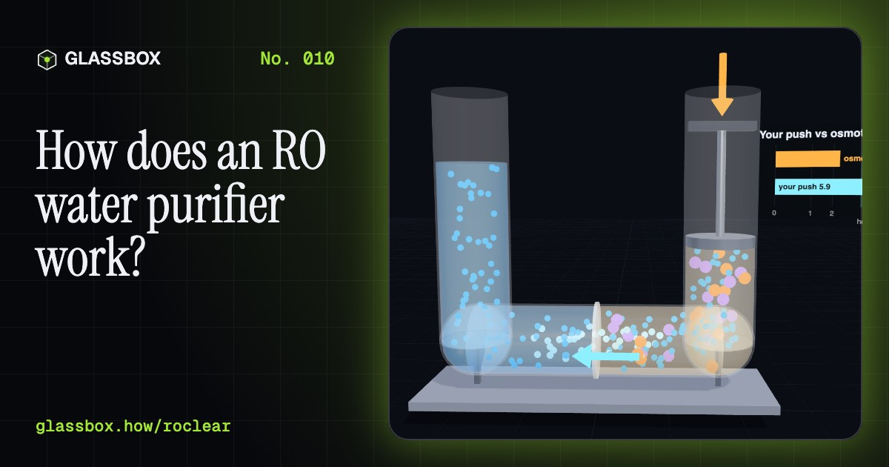
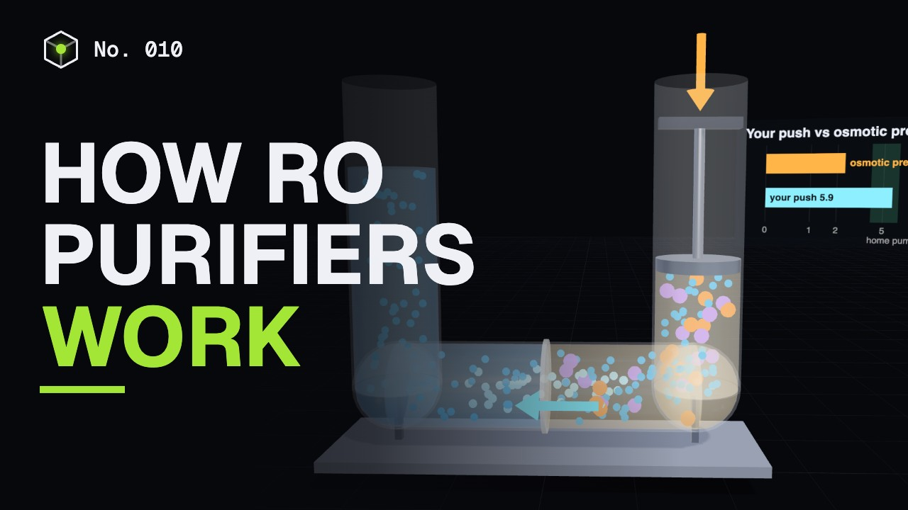
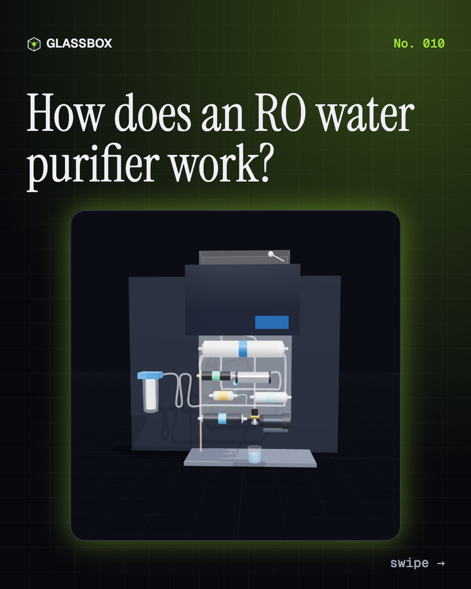
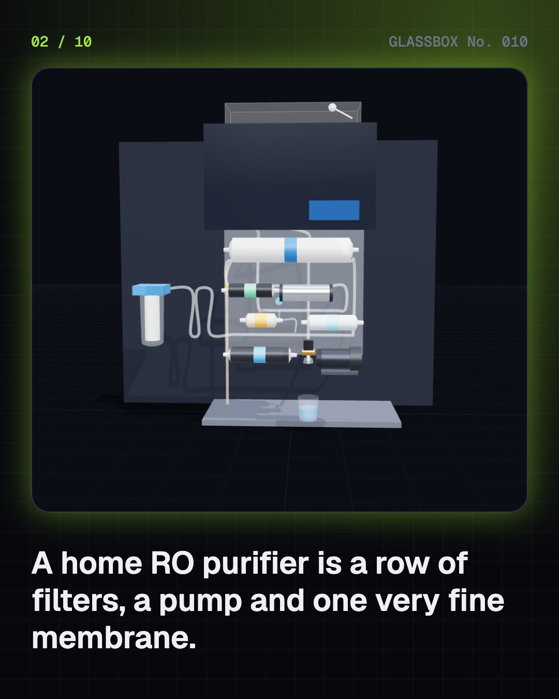
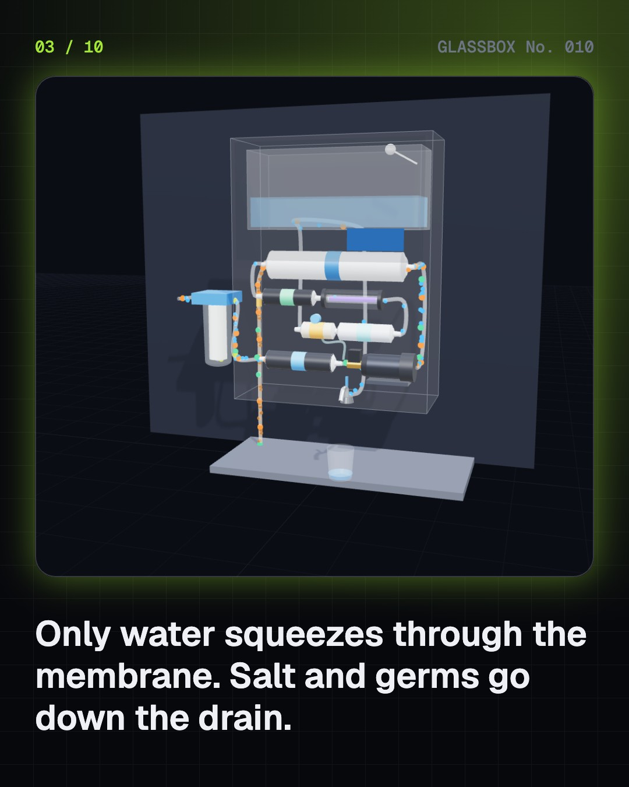
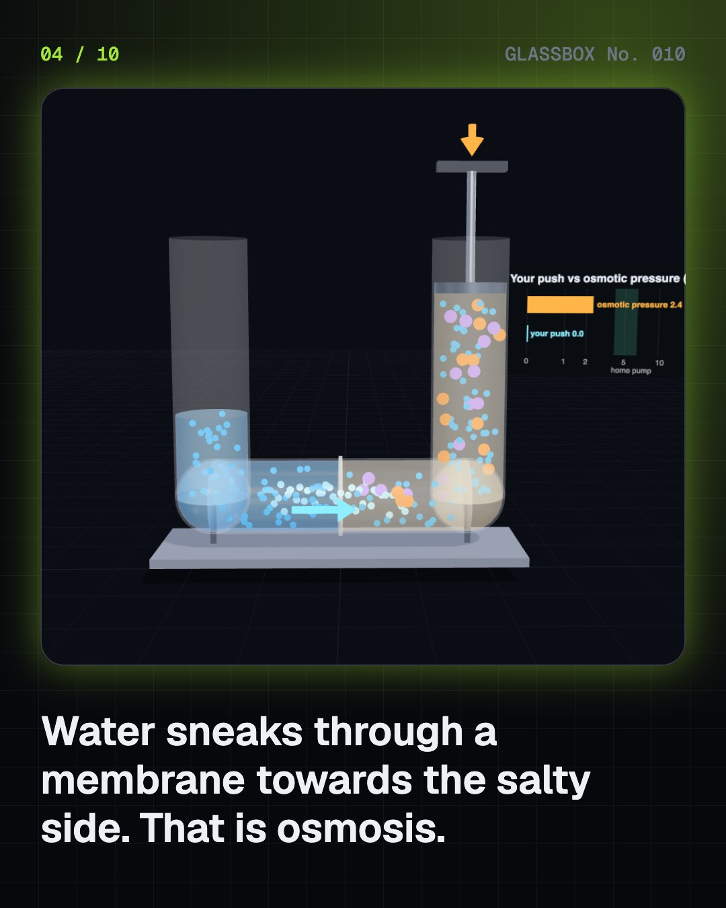

<!-- glassbox:start -->
<!-- Generated from glassbox.json by the Glassbox hub (npm run readme -- roclear). Edit glassbox.json, not this block. -->
<p align="center"><a href="https://glassbox-production-fd52.up.railway.app/e/roclear/"></a></p>

<h1 align="center">ROClear</h1>

<p align="center"><b>How does an RO water purifier work?</b><br>Your kitchen purifier pushes water so hard that it squeezes out of the salt, through a skin with no real holes. Take an RO purifier apart in 3D, flip osmosis backwards, and see where the other two litres go.</p>

<p align="center"><a href="https://glassbox-production-fd52.up.railway.app/roclear/"><b>▶ Play with it</b></a> &nbsp;·&nbsp; <a href="https://glassbox-production-fd52.up.railway.app/e/roclear/">Read the 60-second explainer</a> &nbsp;·&nbsp; <a href="https://glassbox-production-fd52.up.railway.app/roclear/glassbox/reel.mp4">Watch the 40-second video</a></p>

<p align="center">
  <a href="https://glassbox-production-fd52.up.railway.app/e/roclear/"></a>
  <a href="https://glassbox-production-fd52.up.railway.app/e/roclear/"></a>
  <a href="LICENSE"></a>
  <a href="LICENSE-CONTENT.md"></a>
  <a href="#privacy"></a>
</p>

## In 60 seconds

1. **A row of filters and one fine membrane.** A home RO purifier chains a sediment filter, activated carbon, a booster pump, the RO membrane, a carbon polish, a UV lamp and UF fibres, a mineral cartridge and a storage tank. Each stage catches something different: dirt, chlorine, dissolved salts, germs.
2. **Osmosis, run backwards.** Water on its own flows through a membrane towards the saltier side. The push that stops it is the osmotic pressure, about 0.8 bar for water with 1,000 ppm of salt and 27 bar for seawater. A pump pushing harder than that forces fresh water out of the salty side instead.
3. **No holes, just a very thin skin.** The membrane is a polyamide skin about 0.1 to 0.2 micrometres thick, rolled round a tube. Water dissolves into it and diffuses across; ions in their shell of water barely do. It holds back 95 to 99% of dissolved salts, and germs thousands of times bigger than a water molecule.
4. **TDS: less is not always better.** RO takes 1,000 ppm borewell water down to about 50 ppm. India's BIS standard allows up to 500. A TDS controller blends some pre-filtered water back for taste, but that water skipped the membrane, so any fluoride or arsenic in it comes back too.
5. **Most of the water goes down the drain.** The rejected salt has to be washed away, so a typical home unit sends 2 to 3 litres to the drain for every litre you drink. Recover more and the reject gets so salty that scale forms on the membrane. Reject water is fine for mopping and flushing.
6. **UV kills, UF strains, neither desalts.** UV-C light at 254 nm scrambles germs' DNA; the dose falls if the water runs faster or the lamp ages. UF fibres with 0.01 µm pores strain out bacteria and cysts. Both leave salts alone, so low-TDS city water needs only UV or UF, not RO.

## Words worth knowing

| Term | Meaning |
|---|---|
| **Reverse osmosis** | Pushing water through a semi-permeable membrane harder than the osmotic pressure, so fresh water leaves the dissolved salts behind. |
| **Osmotic pressure** | The pressure needed to stop water flowing into a salty solution through a membrane. For salt water, π = iMRT. |
| **Semi-permeable membrane** | A skin that lets water molecules through but blocks dissolved ions. |
| **Thin-film composite** | An RO membrane made of an ultra-thin polyamide layer on a porous support, rolled into a spiral-wound element. |
| **TDS** | Total dissolved solids: everything dissolved in water, in mg per litre (ppm). |
| **Salt rejection** | The share of dissolved salt a membrane holds back, usually 95 to 99%. |
| **Recovery** | The share of the incoming water that comes out purified. The rest leaves as reject. |
| **UV dose** | UV light intensity multiplied by time, in mJ/cm². It sets how many germs are inactivated. |
| **Ultrafiltration** | Filtering through pores about 0.01 µm wide: it catches bacteria and cysts but not dissolved salts. |

## A short history

**3,500 years from settling mud with alum to pushing water backwards through a plastic skin in millions of Indian kitchens.**

- **300** · Boil it, sun it, filter it (Sushruta Samhita (Sanskrit medical text), India)
- **1748** · Water sneaks through a pig's bladder (Jean-Antoine Nollet, Paris, France)
- **1854** · The Broad Street pump (John Snow, Soho, London, England)
- **1908** · Chlorine every day (John L. Leal and George W. Fuller, Jersey City, New Jersey, USA)
- **1960** · A skin thin enough to work (Sidney Loeb and Srinivasa Sourirajan, UCLA, Los Angeles, USA)
- **1965** · A town drinks RO water (Sidney Loeb and the city of Coalinga, Coalinga, California, USA)
- **1981** · The thin-film composite membrane (John Cadotte, FilmTec, Minneapolis, Minnesota, USA)
- **1984** · Aquaguard arrives (Eureka Forbes, India)

The full story, with 29 moments, charts, people and 42 sources: [glassbox.how/e/roclear/history](https://glassbox-production-fd52.up.railway.app/e/roclear/history/). The data lives in [`history.json`](history.json).

## Video and slides

Made with the Glassbox studio from this box's storyboard (`window.glassbox.director`). Free to reuse under CC BY 4.0.

<a href="https://glassbox-production-fd52.up.railway.app/roclear/glassbox/video.mp4"></a>

<p><a href="glassbox/slide-1.jpg"></a> <a href="glassbox/slide-2.jpg"></a> <a href="glassbox/slide-3.jpg"></a> <a href="glassbox/slide-4.jpg"></a></p>

| File | What | Size |
|---|---|---|
| [`glassbox/reel.mp4`](https://glassbox-production-fd52.up.railway.app/roclear/glassbox/reel.mp4) | Reel / Short, with captions and soundtrack | 1080×1920 |
| [`glassbox/video.mp4`](https://glassbox-production-fd52.up.railway.app/roclear/glassbox/video.mp4) | YouTube video, with captions and soundtrack | 1920×1080 |
| `glassbox/slide-1…10.jpg` | Instagram carousel | 1080×1350 |
| `glassbox/thumb.jpg` | YouTube thumbnail | 1280×720 |
| `glassbox/cover.jpg` | Share card and repo social preview | 1200×630 |
| [`glassbox/history-reel.mp4`](https://glassbox-production-fd52.up.railway.app/roclear/glassbox/history-reel.mp4) | “History in 10 moments” Reel / Short | 1080×1920 |
| `glassbox/history-slide-*.jpg` | History carousel | 1080×1350 |
| `glassbox/post.json` | Post copy and schedule used by the publish kit | |

## Privacy

This box has no accounts and no ads, and it ships its own fonts and libraries. When you run it yourself it sends nothing anywhere. On glassbox.how, the site's `/bar.js` also loads Glassbox's analytics: **Google Analytics** to count visits (it asks first in the EU, UK and Switzerland, and stays off when your browser sends Global Privacy Control or Do Not Track) and **ClickTrust** to detect bots.

It remembers a few things **in your own browser only**, and never sends them anywhere:

| Browser storage key | What it holds |
|---|---|
| `roclear.v1` | Which chapters you have opened, your best quiz scores, and sound on or off. |

Exactly what each one sees is at [glassbox.how/privacy](https://glassbox-production-fd52.up.railway.app/privacy/).

## Licences

- **Code:** [MIT](LICENSE). Use it, change it, ship it.
- **Explanations, text, images and videos** (`glassbox.json`, `glassbox/`): [CC BY 4.0](LICENSE-CONTENT.md). Credit “Glassbox, glassbox.how/e/roclear”.
- **Third-party parts** keep their own licences: [three.js](https://threejs.org) (MIT), [Geist, Instrument Serif](https://openfontlicense.org) (SIL OFL 1.1).
- The Glassbox name and logo aren't covered by either licence. See the [terms](https://glassbox-production-fd52.up.railway.app/terms/).

Found a mistake? [Open an issue](https://github.com/bdeeps/roclear/issues). Corrections happen in public.
<!-- glassbox:end -->

## Run it

It's plain HTML, CSS and JavaScript. No build step and no dependencies. Run locally, it contacts no other website.

```bash
python3 -m http.server 8000
```

Three.js and the fonts ship in `vendor/` and `fonts/`, so it also works offline.

Then open http://localhost:8000.

## How it's built

| File | What |
|---|---|
| `index.html`, `css/app.css` | The page and its styles |
| `js/app.js`, `js/stage.js`, `js/ui.js`, `js/kit.js` | The shared Glassbox 3D engine: chapters, 3D stage, controls, quiz, video director |
| `js/chapters/*.js` | One file per chapter: the 3D model, controls, text, key terms, quiz and video scenes |
| `js/ro.js` | ROClear's physics and parts: osmotic pressure (van 't Hoff), membrane flow, TDS blending, recovery sums, UV dose and log kill, and the 3D cartridges, pump, tank and tap |
| `glassbox.json` | Title, question, explainer beats, key terms, browser storage and credits shown on glassbox.how |
| `reel` in each chapter | The storyboard the Glassbox studio records into short videos |
| `glassbox/` | The published video, slides, thumbnail and post copy |
| `fonts/`, `vendor/three/` | Self-hosted Geist and Instrument Serif (SIL OFL 1.1) and three.js (MIT) |
